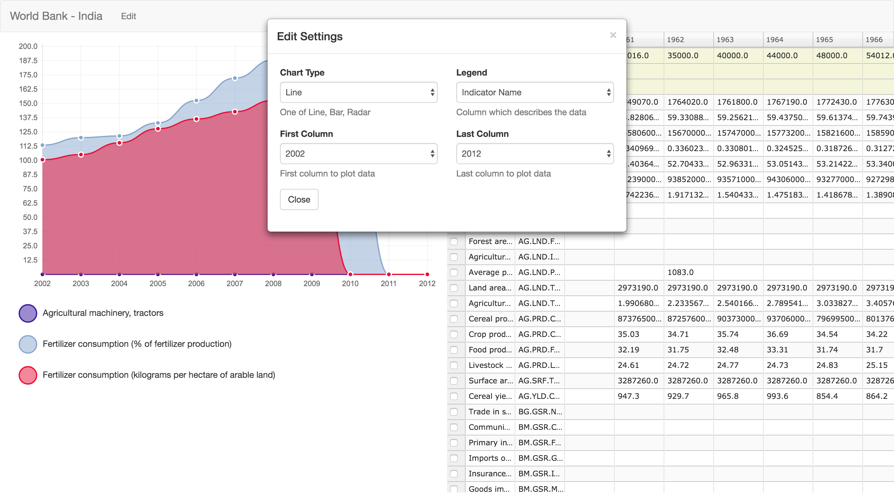

# Chart Builder

Build Line or Bar graphs using using ChartJS and SlickGrid

---

To try this out:

1. Clone this repository
2. `python -m SimpleHTTPServer 9000`
3. Go to `http://localhost:9000` in your browser
